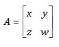

# HTML5 MathML 教程

HTML5 的 HTML 语法允许我们在文档内使用 &lt;math&gt;...&lt;/math&gt; 标签应用 MathML 元素。

大多数浏览器都能显示 MathML 标签。如果你的浏览器不支持 MathML，建议你使用最新版的 FireFox。

可以在 [MathML 2.0 规范](http://www.w3.org/TR/MathML2/) 页面查看 W3C 的 MathML 规范。

## MathML 示例

下面是一个使用 MathML 的有效 HTML5 文档：

```html
<!doctype html>
  <html>
  <head>
  <meta charset="UTF-8">
  <title>Pythagorean theorem</title>
  </head>
  <body>
    <math xmlns="http://www.w3.org/1998/Math/MathML">
      <mrow>
        <msup><mi>a</mi><mn>2</mn></msup>
        <mo>+</mo>
        <msup><mi>b</mi><mn>2</mn></msup>
        <mo>=</mo>
        <msup><mi>c</mi><mn>2</mn></msup>
      </mrow>
    </math>
  </body>
</html> 
```

这会生成如下结果：

```
a2 + b2 = c2
```

便于学习这一概念 - 请使用 FireFox 3.7 或更高版本进行[在线练习](http://www.tutorialspoint.com/cgi-bin/practice.cgi?file=html5-22.htm)。

## 使用 MathML 字符

想象一下，下面是一个使用字符 &amp;InvisibleTimes; 的标记：

```html
<!doctype html>
  <html>
  <head>
  <meta charset="UTF-8">
  <title>MathML Examples</title>
  </head>
  <body>
    <math xmlns="http://www.w3.org/1998/Math/MathML">
       <mrow>
          <mrow>
             <msup>
                <mi>x</mi>
                <mn>2</mn>
             </msup>
             <mo>+</mo>
             <mrow>
                <mn>4</mn>
                <mo>⁢⁢⁢&InvisibleTimes;</mo>
                <mi>x</mi>
             </mrow>
             <mo>+</mo>
             <mn>4</mn>
          </mrow>
             <mo>=</mo>
             <mn>0</mn>
        </mrow>
   </math>
</body>
</html> 
⁢```

这会生成如下结果。如果你不能看到 x<sup>2</sup> + <sup>4</sup> + 4 = 0 这样正确的结果，请使用 FireFox 3.5 或更高的版本。

x<sup>2</sup> + <sup>4</sup> + 4 = 0

便于学习这一概念 - 请使用 FireFox 3.7 或更高版本进行[在线练习](http://www.tutorialspoint.com/cgi-bin/practice.cgi?file=html5-20.htm)。

## 矩阵表达示例

想象一下下面的例子，它会被用来表示一个简单的 2x2 矩阵：

```html
<!doctype html>
  <html>
  <head>
  <meta charset="UTF-8">
  <title>MathML Examples</title>
  </head>
  <body>
    <math xmlns="http://www.w3.org/1998/Math/MathML">
       <mrow>
          <mi>A</mi>
          <mo>=</mo>
          <mfenced open="[" close="]">
             <mtable>
                <mtr>
                   <mtd><mi>x</mi></mtd>
                   <mtd><mi>y</mi></mtd>
                </mtr>
                <mtr>
                   <mtd><mi>z</mi></mtd>
                   <mtd><mi>w</mi></mtd>
                </mtr>
             </mtable>
         </mfenced>
      </mrow>
   </math>
</body>
</html> 
```

这会生成如下结果。如果不能看到正确的结果，请使用 FireFox 3.7 或更高的版本。



便于学习这一概念 - 请使用 FireFox 3.7 或更高版本进行[在线练习](http://www.tutorialspoint.com/cgi-bin/practice.cgi?file=html5-21.htm)。