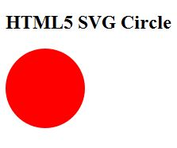
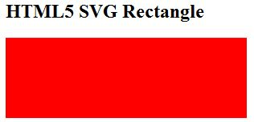
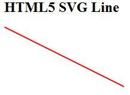
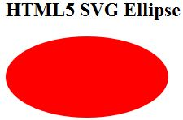
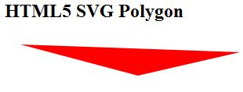
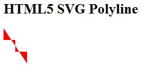
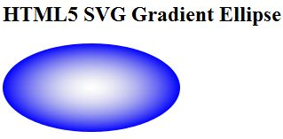

# HTML5 SVG 教程

SVG 表示可伸缩矢量图形，这是一门用于描述 2D 图形的语言，图形应用使用 XML 编写，然后 XML 由 SVG 阅读器程序呈现。

SVG 主要用于矢量类型的图表，比如饼图，X，Y 坐标系统中的二维图等等。

SVG 在 2003 年 1 月 14 日成为 W3C 推荐标准，你可以在 [SVG 规范](http://www.w3.org/TR/SVG/) 页面中查看最新版本的 SVG 规范。

## 查看 SVG 文件

大多数 Web 浏览器都可以显示 SVG，就像它们可以显示 PNG，GIF 以及 JPG 图形。IE 用户可能需要安装 [Adobe SVG 阅读器](http://www.adobe.com/svg/viewer/install/) 以便能够在浏览器中查看 SVG。

## 在 HTML5 中嵌入 SVG

HTML5 允许我们直接使用  __&lt;svg&gt;...&lt;/svg&gt; 标签嵌入 SVG，下面是简单的语法：

```html
<svg xmlns="http://www.w3.org/2000/svg">
...    
</svg>
```

FireFox 3.7 还引入了一个配置选项（"about:config"），可以通过下列步骤启用 HTML5：

1. 在 FireFox 地址栏中输入 __about:config__。
2. 在出现警告消息的地方点击 “I'll be careful, I promise!” 按钮（确保遵守它）。
3. 在页面顶部的过滤器中输入 __html5.enable__。
4. 默认可能被禁用了，因此要点击它切换它的值为 true。

现在，FireFox HTML5 解析器应该启用了，然后可以实验下面的例子。

## HTML5 - SVG 圆

下面是一个 SVG 示例的 HTML5 版本，用 &lt;circle&gt; 标签绘制一个圆：

```html
<!DOCTYPE html>
<head>
<title>SVG</title>
<meta charset="utf-8" />
</head>
<body>
<h2>HTML5 SVG Circle</h2>
<svg id="svgelem" height="200" xmlns="http://www.w3.org/2000/svg">
    <circle id="redcircle" cx="50" cy="50" r="50" fill="red" />
</svg>
</body>
</html>
```

在启用 HTML5 的最新版 FireFox 中会生成如下结果：



便于学习这一概念 - 请使用 FireFox 3.7 或更高的版本进行[在线练习](http://www.tutorialspoint.com/cgi-bin/practice.cgi?file=html5-13.htm)。

## HTML5 - SVG 矩形

下面是一个 SVG 示例的 HTML5 版本，用 &lt;rect&gt; 标签绘制一个矩形：

```html
<!DOCTYPE html>
<head>
<title>SVG</title>
<meta charset="utf-8" />
</head>
<body>
<h2>HTML5 SVG Rectangle</h2>
<svg id="svgelem" height="200" xmlns="http://www.w3.org/2000/svg">
    <rect id="redrect" width="300" height="100" fill="red" />
</svg>
</body>
</html>
```

在启用 HTML5 的最新版 FireFox 中会生成如下结果：



便于学习这一概念 - 请使用 FireFox 3.7 或更高的版本进行[在线练习](http://www.tutorialspoint.com/cgi-bin/practice.cgi?file=html5-14.htm)。

## HTML5 - SVG 线条

下面是一个 SVG 示例的 HTML5 版本，用 &lt;line&gt; 标签绘制一个线条：

```html
<!DOCTYPE html>
<head>
<title>SVG</title>
<meta charset="utf-8" />
</head>
<body>
<h2>HTML5 SVG Line</h2>
<svg id="svgelem" height="200" xmlns="http://www.w3.org/2000/svg">
    <line x1="0" y1="0" x2="200" y2="100"
          style="stroke:red;stroke-width:2"/>
</svg>
</body>
</html>
```

你可以使用 style 属性给它设置额外的样式信息，比如笔画，填充色，笔画宽度等等。

在启用 HTML5 的最新版 FireFox 中会生成如下结果：



便于学习这一概念 - 请使用 FireFox 3.7 或更高的版本进行[在线练习](http://www.tutorialspoint.com/cgi-bin/practice.cgi?file=html5-15.htm)。

## HTML5 - SVG 椭圆

下面是一个 SVG 示例的 HTML5 版本，用 &lt;ellipse&gt; 标签绘制一个椭圆：

```html
<!DOCTYPE html>
<head>
<title>SVG</title>
<meta charset="utf-8" />
</head>
<body>
<h2>HTML5 SVG Ellipse</h2>
<svg id="svgelem" height="200" xmlns="http://www.w3.org/2000/svg">
    <ellipse cx="100" cy="50" rx="100" ry="50" fill="red" />
</svg>
</body>
</html>
```

在启用 HTML5 的最新版 FireFox 中会生成如下结果：



便于学习这一概念 - 请使用 FireFox 3.7 或更高的版本进行[在线练习](http://www.tutorialspoint.com/cgi-bin/practice.cgi?file=html5-16.htm)。

## HTML5 - SVG 多边形

下面是一个 SVG 示例的 HTML5 版本，用 &lt;polygon&gt; 标签绘制一个多边形：

```html
<!DOCTYPE html>
<head>
<title>SVG</title>
<meta charset="utf-8" />
</head>
<body>
<h2>HTML5 SVG Polygon</h2>
<svg id="svgelem" height="200" xmlns="http://www.w3.org/2000/svg">
    <polygon  points="20,10 300,20, 170,50" fill="red" />
</svg>
</body>
</html>
```

在启用 HTML5 的最新版 FireFox 中会生成如下结果：



便于学习这一概念 - 请使用 FireFox 3.7 或更高的版本进行[在线练习](http://www.tutorialspoint.com/cgi-bin/practice.cgi?file=html5-17.htm)。

## HTML5 - SVG 折线

下面是一个 SVG 示例的 HTML5 版本，用 &lt;polyline&gt; 标签绘制一个折线图：

```html
<!DOCTYPE html>
<head>
<title>SVG</title>
<meta charset="utf-8" />
</head>
<body>
<h2>HTML5 SVG Polyline</h2>
<svg id="svgelem" height="200" xmlns="http://www.w3.org/2000/svg">
 <polyline points="0,0 0,20 20,20 20,40 40,40 40,60" fill="red" />
</svg>
</body>
</html>
```

在启用 HTML5 的最新版 FireFox 中会生成如下结果：



便于学习这一概念 - 请使用 FireFox 3.7 或更高的版本进行[在线练习](http://www.tutorialspoint.com/cgi-bin/practice.cgi?file=html5-18.htm)。

## HTML5 - SVG 渐变

下面是一个 SVG 示例的 HTML5 版本，用 &lt;ellipse&gt; 标签绘制一个椭圆，使用 &lt;radialGradient&gt; 标签定义一个 SVG 径向渐变。

我们可以以类似的方式用 &lt;linearGradient&gt; 标签创建 SVG 线性渐变。

```html
<!DOCTYPE html>
<head>
<title>SVG</title>
<meta charset="utf-8" />
</head>
<body>
<h2>HTML5 SVG Gradient Ellipse</h2>
<svg id="svgelem" height="200" xmlns="http://www.w3.org/2000/svg">
   <defs>
      <radialGradient id="gradient" cx="50%" cy="50%" r="50%"
      fx="50%" fy="50%">
      <stop offset="0%" style="stop-color:rgb(200,200,200);
      stop-opacity:0"/>
      <stop offset="100%" style="stop-color:rgb(0,0,255);
      stop-opacity:1"/>
      </radialGradient>
   </defs>
   <ellipse cx="100" cy="50" rx="100" ry="50" 
      style="fill:url(#gradient)" />
</svg>
</body>
</html>
```

在启用 HTML5 的最新版 FireFox 中会生成如下结果：



便于学习这一概念 - 请使用 FireFox 3.7 或更高的版本进行[在线练习](http://www.tutorialspoint.com/cgi-bin/practice.cgi?file=html5-19.htm)。