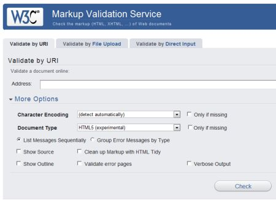
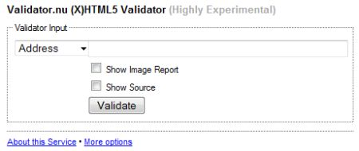

# HTML5 验证

编写这个教程时 HTML5 还处在初始阶段，网络上只有少量的几个验证器可用。

下面两个验证器是非常可靠且可用的。

## (1) W3C Markup Validator

[W3C Markup Validator](http://validator.w3.org/#validate_by_uri+with_options) 可以检查 HTML，XHTML，SMIL，MathML 等格式的 Web 文档标记的有效性。这个验证器是 W3C 标准验证服务 Unicorn 的一部分。

要对 HTML5 使用这个验证器，需要使用 __More Options__ 选项以及选择 __Document Type__ 为 __HTML5(实验性)__，如下所示：

## (2) The Validator.nu (X)HTML5 Validator

下面是另一个当前已知的 HTML5 验证器。Henri 的 [Validator.nu (X)HTML5 Validator](http://html5.validator.nu/)（高度实验性的）。

这个验证器有兼容性问题，可以在低版本的 IE 或者 Mozilla 中尝试。