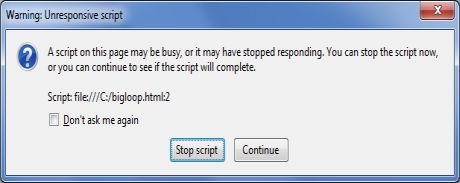

# HTML5 Web Workers

JavaScript 被设计为运行在一个单线程环境中，这意味着多个脚本不能同时运行。考虑这样一种情况，我们需要处理 UI 时间，查询和处理大量的 API 数据以及操作 DOM。

在 CPU 使用率过高的情况下 JavaScript 还会造成浏览器假死。我们来举一个简单的例子，用 JavaScript 运行一个大循环：

```html
<!DOCTYPE HTML>
<html>
<head>
<title>Big for loop</title>
  <script>
      function bigLoop(){
         for (var i = 0; i <= 10000000000; i += 1){
            var j = i;
         }
         alert("Completed " + j + "iterations" );
      }
      function sayHello(){
         alert("Hello sir...." );
      }
  </script>
</head>
<body>
   <input type="button" onclick="bigLoop();" value="Big Loop" />
   <input type="button" onclick="sayHello();" value="Say Hello" />
</body>
</html>
```

尝试运行在线示例来查看其结果 — 可以使用任何浏览器运行[在线示例](http://www.tutorialspoint.com/cgi-bin/practice.cgi?file=html5-60.htm)。当我们在 FireFox 中点击 _Big Loop_ 按钮是它会显示如下所示结果：



## 什么是 Web Workers？

上述情况可以使用 __Web Workers__ 处理，它可以处理所有昂贵的计算任务而不阻塞用户界面，它通常运行在单独的线程上。

Web Workers 允许长时间运行脚本，而不阻塞脚本响应点击或者其他用户交互；它还允许执行长期任务而无需页面保持响应。

Web Workers 就是背景脚本，它们是相对重量级的，并不打算被大量使用。比如，它并不适合为一个四百万像素图像的每一个像素启动一个 worker。

当脚本执行在 Web Worker 中时，它不能访问 Web 页面的 window 对象（window.document），这意味着这个 Web Workers 不必直接访问该页面和 DOM API。尽管 Web Workers 不能阻塞浏览器 UI，但它们仍然会消耗 CPU 周期，降低系统的响应速度。

## Web Workers 的工作原理

Web Workers 使用 JavaScript 文件 URL 初始化，这个文件包含要在 worker 中执行的代码。这个代码可以设置事件监听器，与引入它的主页面进行通信。下面是简单的语法：

```javascript
var worker = new Worker('bigLoop.js');
```

如果指定的 JavaScript 文件已经存在，浏览器会启动一个新异步下载的 worker 线程。如果 worker 路径返回 404，那么这个 worker 会静默失败。

如果你的应用程序要支持多个 JavaScript 文件，你可以将它们导入到 __`importScripts()`__ 方法中，这个方法接收逗号分割的文件名作为参数，如下所示：

```javascript
importScripts("helper.js", "anotherHelper.js");
```

一旦 Web Worker 启动，就可以使用 __postMessage()__ 方法在 web worker 和父页面之间进行通信。依赖于浏览器或浏览器版本，postMessage() 方法可以接受一个字符串或者 JSON 对象作为它的唯一参数。

通过 Web Worker 攒底的消息可以在主页面中使用 __onmessage__ 时间访问。现在让我们用 Web Worker 编写上面的 bigLoop 示例。下面是要启动 web worker 执行循环和返回变量 __j__ 最终值的主页面（hello.htm）。

```html
<!DOCTYPE HTML>
<html>
<head>
<title>Big for loop</title>
  <script>
      var worker = new Worker('bigLoop.js');
      worker.onmessage = function (event) {
        alert("Completed " + event.data + "iterations" );
      };

      function sayHello(){
         alert("Hello sir...." );
      }
  </script>
</head>
<body>
   <input type="button" onclick="sayHello();" value="Say Hello"/>
</body>
</html>
```

下面是 bigLoop.js 文件的内容。这里使用 __postMessage()__ API 来传递通信信息给主页面。

```javascript
for (var i = 0; i <= 1000000000; i += 1){
   var j = i;
}
postMessage(j);
```

接下来我们把 hello.htm 和 bigLoop.js 文件放入同一个目录中，然后使用最新版的 Safari 或 FireFox 访问 hello.htm。

也可以在线查看上述示例的结果 - 可以使用最新版的 Safari 或 FireFox [在线尝试](http://www.tutorialspoint.com/cgi-bin/practice.cgi?file=html5-61.htm)。

## 停止 Web Workers

Web Workers 不能自行停止，但是启动它们的页面可以通过调用 __`terminate()`__ 方法停止它们。

```javascript
worker.terminate();
```

被终止的 Web Worker 将不再响应消息或者执行任何附加的计算。我们并不能重启 worker；但是，可以使用同一 URL 创建一个新的 worker。

## 错误处理

下面的代码展示了一个在 Web Worker JavaScript 文件中错误处理函数输出错误日志到控制台的例子。这个带有错误处理代码的例子如下所示：

```html
<!DOCTYPE HTML>
<html>
<head>
<title>Big for loop</title>
  <script>
      var worker = new Worker('bigLoop.js');
      worker.onmessage = function (event) {
        alert("Completed " + event.data + "iterations" );
      };

      worker.onerror = function (event) {
         console.log(event.message, event);
      };

      function sayHello(){
         alert("Hello sir...." );
      }
  </script>
</head>
<body>
   <input type="button" onclick="sayHello();" value="Say Hello"/>
</body>
</html>
```

## 浏览器支持检测

下面的代码可用于浏览器中检测是否支持 Web Worker 特性：

```html
<!DOCTYPE HTML>
<html>
<head>
<title>Big for loop</title>
  <script src="/js/modernizr-1.5.min.js"></script>
  <script>
   if (Modernizr.webworkers) {
      alert("Congratulation!! you have web workers support." );
   }else{
      alert("Sorry!! you do not have web workers support." );
   }
  </script>
</head>
<body>
   <p>Checking for Browser Support for web workers</p>
</body>
</html>
```

可以尝试在线示例查看结果 - 请使用不同的浏览器运行[在线示例](http://www.tutorialspoint.com/cgi-bin/practice.cgi?file=html5-62.htm)。